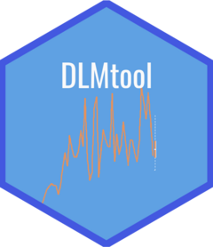

<!-- README.md is generated from README.Rmd. Please edit that file -->

# DLMtool 

<!-- badges: start -->

[](https://CRAN.R-project.org/package=DLMtool)
[](https://github.com/Blue-Matter/DLMtool/actions)
[](https://github.com/blue-matter/DLMtool)
<!-- badges: end -->

The Data-Limited Methods toolkit (DLMtool) is a collection of
data-limited management procedures that can be evaluated with management
strategy evaluation (MSE).

DLMtool is part of the `openMSE` collection of packages.

You can learn more about the `openMSE` packages at the [openMSE
documentation site](https://openMSE.com).

## Installation

You can install the released version of DLMtool from
[CRAN](https://CRAN.R-project.org) with:

``` r
install.packages("DLMtool")
```

And the development version from [GitHub](https://github.com/) with:

``` r
# install.packages("devtools")
devtools::install_github("Blue-Matter/DLMtool")
```
